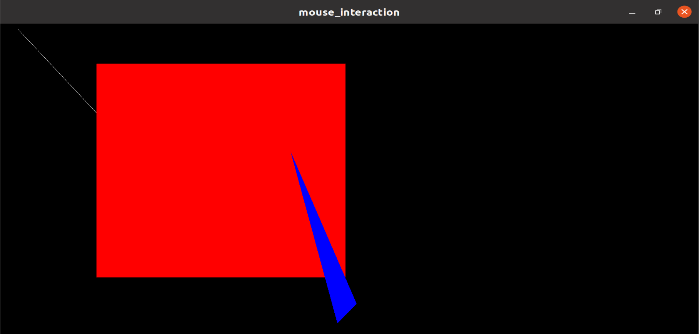

# 基于OpenGL鼠标交互绘制图形

## 代码明细

- drawLine(), drawRec(), drawTri() 绘制线、矩形、三角形图形。
- myMotion(), myMouse() 捕捉鼠标行为并记录坐标。
- processMenuEvents(), GLUTMenus() 创建菜单并且定义鼠标交互方式（中键唤起菜单，右键选择菜单选项）。
- display() 在不同的位置画出不同的图形。
- main() 初始化窗口大小、窗口位置、底色等参数信息，然后画出图案。

## 环境配置

- OS：Ubuntu20.04
- gcc
- OpenGL

## 运行命令

- 控制台输入命令 `sh main.sh`
- 点击鼠标中键唤起菜单，点击右键选择不同图案
- 鼠标左键点击绘制起点，拖动到绘制终点松开鼠标左键即可绘制图形

## 实验效果
