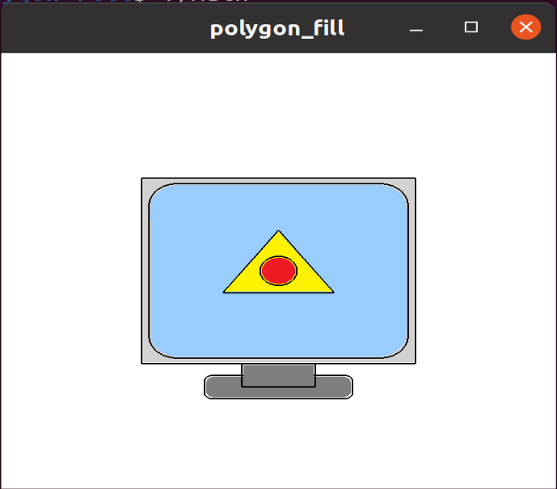

# 基于OpenGL的平面多边形区域填充

## 代码明细

- glRoundRec(), glArc(), glCircle(), glTri() 函数负责在用不同模式（GL_LINE_LOOP或GL_POLYGON）绘制图形
- glFillRect(), glFillTri(), glFillRoundRec(), glFillCircle() 函数先用GL_LINE_LOOP模式画出图形边框，再以GL_POLYGON模式在边框内部填充一个带有颜色的图形。
- display() 在不同的位置画出不同的图形
- main() 初始化窗口大小、窗口位置、底色等参数信息，然后画出图案

## 环境配置

- OS：Ubuntu20.04
- gcc
- OpenGL

## 运行命令

- 控制台输入命令 `sh main.sh`

## 实验效果

