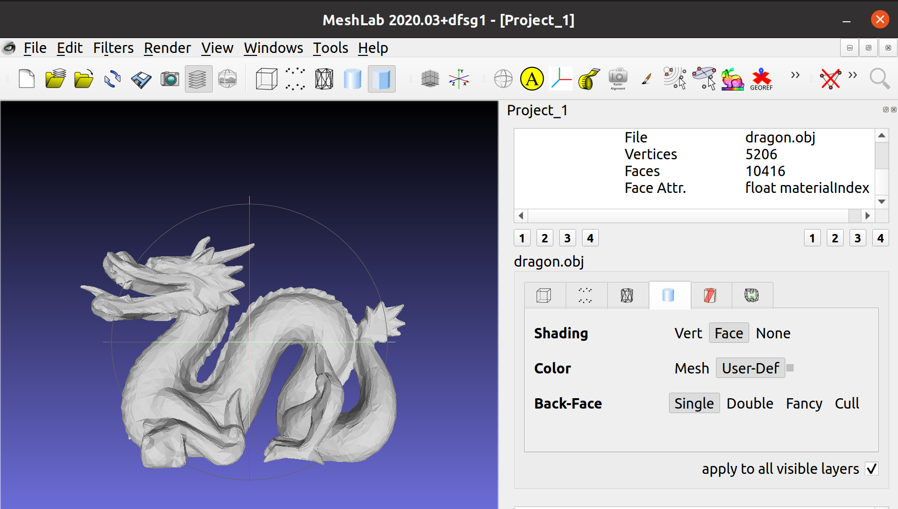
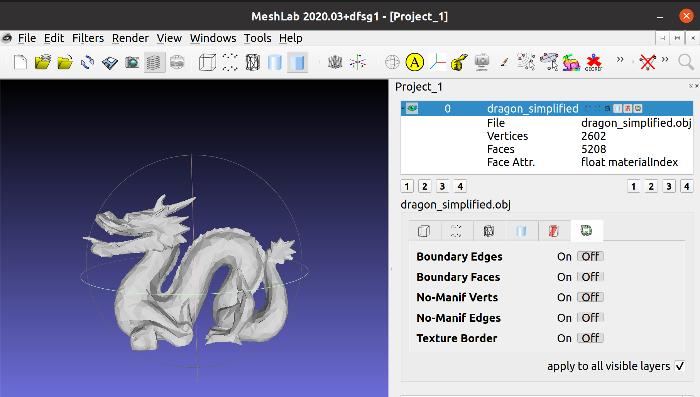

# 网格简化

## 代码明细

- main.cpp
  - 负责模型的导入与输出
- mesh_simplify.cpp：
  - 使用基于二次误差度量的算法进行网格简化,
- display.cpp:
  - 自行计算每一个顶点的法向量,使用Exam2的方法显示三维模型

## 环境配置

- OS：Ubuntu20.04
- gcc
- OpenGL/glut
- OpenMesh-9.0.0
- Eigen-3.4.0

## 运行命令

- 控制台依次输入命令 

    `make`

    `./main dragon.obj simplified_dragon.obj 0.5` 
- 简化比例缺省为0.5,可以按需修改

## 实验效果

- 简化前:

- 简化后:

