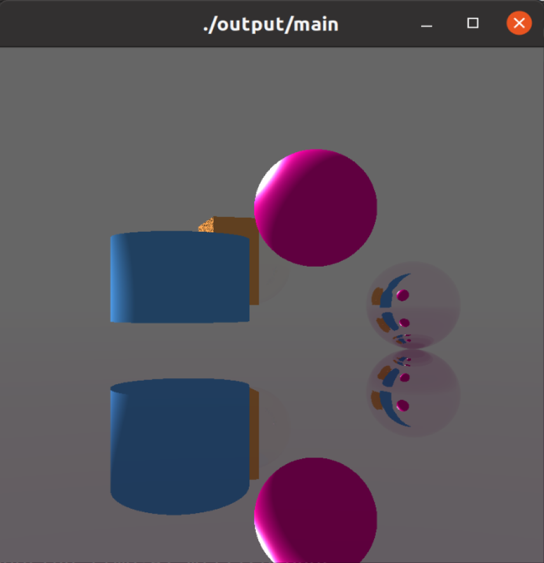
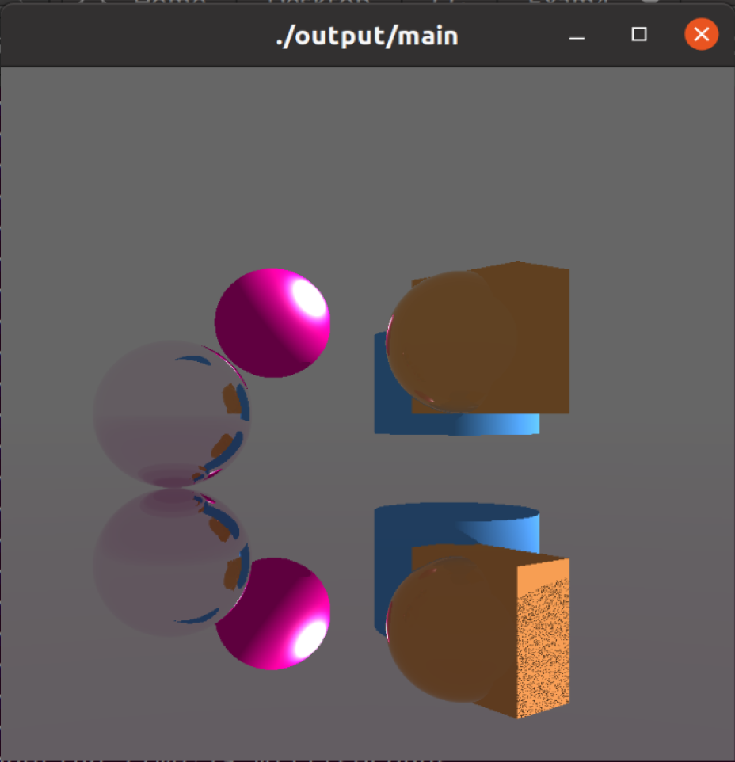

# 光线追踪

## 代码明细

- main.cpp
  - 调用OpenGL接口，负责渲染与输出
- trace.cpp：
  - 定义模型的位置大小材料和光源的位置、求交、追踪迭代

## 环境配置

- OS：Ubuntu20.04
- gcc
- OpenGL/glut

## 运行命令

```bash
make
./output/main
```
或
```bash
make run
```

## 实验效果




## 参考文献

1. http://t.csdnimg.cn/AbAYk
2. https://zhouyifan.net/2020/02/08/Cpp-Ray-Tracing-running-on-CPU/
3. https://zhuanlan.zhihu.com/p/535052415
4. http://t.csdnimg.cn/BisEJ